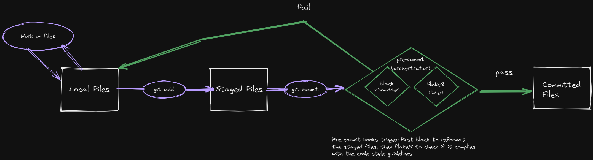

# Contributing to PyEuropeana

**Hello there!** We created this document as a way to communicate with potential contributors (that's you) and to establish a common ground over which we can keep on growing and solidifying the PyEuropeana project. If you made up your mind about being a contributor, **that's great!** Reading through this document can help you immensely and cut back on the time you spend on contributing to PyEuropeana. If you are not sure about being a contributor yet or if you are just taking a look, then this document can still provide you some insights about how we go about developing PyEuropeana. 

## Table of contents

- [**Different ways of contributing**](#different-ways-of-contributing)
- [**Communicating with the maintainers**](#communicating-with-the-maintainers)
  - [**Who are the maintainers?**](#who-are-the-maintainers)
  - [**How do I initiate communication?**](#how-do-i-initiate-communication)
  - [**Writing a meaningful issue**](#writing-a-meaningful-issue)
- [**Understanding our Git workflow**](#understanding-our-git-workflow)
  - [**Possible branches**](#possible-branches)
  - [**Branching rules**](#branching-rules)
  - [**General tips and guidelines**](#general-tips-and-guidelines)
  - [**Git commands cheatsheet**](#git-commands-cheatsheet)
- [**Setting up and using your development environment**](#setting-up-and-using-your-development-environment)
  - [**Prerequisites**](#prerequisites)
  - [**Download all the files related to the project**](#download-all-the-files-related-to-the-project)
  - [**Create a Python virtual environment & install PyEuropeana and its dependencies**](#create-a-python-virtual-environment--install-pyeuropeana-and-its-dependencies)
  - [**Configure local development tools**](#configure-local-development-tools)
- [**Style guide**](#style-guide)
  - [**Code style**](#code-style)
    - [**Actionable tips**](#actionable-tips)
  - [**Documentation style**](#documentation-style)
- [**Extra: Adding new dependencies to the project**](#extra-adding-new-dependencies-to-the-project)

## Different ways of contributing

So, what do we mean by contributing? One thing that probably comes to your mind is **writing Python code and adding it to the PyEuropeana codebase.** This code can be:

- the code necessary for a new feature
- code for the refactoring of the existing codebase
- a bugfix

However, **writing code is not the only way through which you can contribute to PyEuropeana.** For us, contribution also includes:

- Offering feedback on the project
- Submitting bug reports
- Submitting feature requests and enhancement proposals
- Improving API documentation
- Improving high-level documentation files (like this file and README.md)
- Adding tutorials and use cases
- Increasing test coverage

**All of these items are as valuable to us as dealing directly with the codebase by means of writing Python code** Do not hesitate to communicate with the maintainers if you have a question, an idea, or a proposal.

## Communicating with the maintainers

### Who are the maintainers?

The PyEuropeana project is developed and maintained by a core group of developers from Europeana. **This group of people are called *the maintainers.***

### How do I initiate communication?

If you have any idea about potential contributions or a request, it is a good idea to first get into contact with them or at least to look at the current issues that are being discussed. You can do that through [the **issues tab** found in the project's GitHub repository](https://github.com/europeana/rd-europeana-python-api/issues). You can use the issues tab not only to request or propose enhancements, but also to:

- Give feedback
- Ask questions
- Create a discussion topic
- Point at bugs

If you want to initiate discussion regarding any of these, click on the **new issue** button and start writing! 

### Writing a meaningful issue

With this said, here's a list of tips and best practices that can help you in getting your request, idea or message across.

1. Choose a meaningful title. The title of your issue should be brief yet informative about its scope. Refrain from composing titles like *x doesn't work* or *please help me!*. Instead, briefly mention what the issue is about.
2. Use prefixes in the title. You've seen above that we were able to roughly classify different reasons for communication. It is a good idea to prefix your title by using the following prefixes:
   1. *feedback:*...
   2. *question:*...
   3. *discussion:*...
   4. *bug:*...
   5. *enhancement:*...
3. Add more context to prefixes by using labels. GitHub allows us to tag issues with labels while you are working on composing them. We've prepared a list of eight labels that can further add context to your issue. You can access these labels in GitHub while you are preparing or editing an issue. These labels are:
   1. *feedback*
   2. *question*
   3. *discussion*
   4. *potential-bug*
   5. *confirmed-bug*
   6. *general-enhancement*
   7. *feature-enhancement*
   8. *documentation-enhancement*
4. If you are reporting a potential bug, provide context and code. Stating the exact conditions under which you encountered a problem will help you get to a solution faster. By stating the exact conditions, we mean:
   1. Briefly explaining what the bug you encountered is. Is it an error? Is it a mismatch of expectations?
   2. Listing the details of the computational environment you encountered the bug in. What version of the package? Which Python version? Which operating system?
   3. A minimally reproducible code snippet that can be used to replicate the error. Try to tidy up your code beforehand so that we can understand it better. Abstract away usecase-specific details and include only what is necessary.
5. If you are proposing or requesting an enhancement of any kind, try to explain the reasoning behind your request or proposal. Why was this enhancement needed? What problems does it solve?

## Development workflow

## Understanding our Git workflow

PyEuropeana uses the Git version control system to allow version controlling and facilitate distributed development. Our repository host of choice is GitHub and the following guidelines include some GitHub-specific sections. We try to stick to a pre-determined workflow to standardize how we use Git. The workflow that we use is a derivation of the workflow as explained [here](https://gist.github.com/digitaljhelms/4287848). Below you can find an overview of the current workflow.

### Possible branches

There are two evergreen branches that are present at any given time during project development:

1. The **stable** branch: This branch is the branch that contains the code deployed to production.
2. The **master** branch: This is the branch that most of the development efforts start with and end in.

Besides these evergreen branches, three types of temporary branches can exist:

1. The **feature-** branches: These branches are used to develop new features and implement minor/major overhauls.
2. The **bug-** branches: These branches are used to fix non-critical bugs that are discovered in the codebase.
3. The **hotfix-** branches: These branches are used to fix critical bugs that are discovered in the codebase. The main difference in between these branches and the **bug-** branches are urgency and branching rules (see below).

### Branching rules

The branches above not only differ in semantics but also in **how they are interacted with, where they stem from and where they terminate in.** The branching rules that govern how to interact with these branch types are as follows:

- **origin/stable** is the production branch. Temporary branches do not stem from or merge to **origin/stable** with the exception of **hotfix-** branches.
- **origin/master** is the development branch. It is in principle a branch of the **origin/stable** branch. **feature-** branches and **bug-** branches stem from and merge to this branch.
- Once **origin/master** reaches a certain level of maturity and robustness after bugfixes and feature development, it is merged into **origin/stable**. This merge also constitutes a minor/major version increment.
- **feature-** branches stem from and merge to **origin/master**.
- **bug-** branches stem from and merge to **origin/master**.
- **hotfix-** branches stem from and merge to **origin/stable**.
- Once a **-hotfix-** branch is merged to master, master is retroactively updated from **origin/stable** and all of the merge conflicts are resolves in favor of the **origin/stable** branch.
- It is up to the branch contributor to periodically check for and fetch changes from **origin/master** in order to keep the current branch updated.

### General tips and guidelines

There are a few more things to keep in mind while working with our Git workflow besides the interactions patterns outlined above.

- Collaborators from outside Europeana do not have branch manipulation rights in the GitHub repo. As an external contributor, you need to make a fork of the project before making any branches.
- Use the prefixes outlined above when naming your branches along with short but informative names. *fix-bug* is not a good branch name, but *bug-duplicate-search-results* is. You can alternatively use issue numbers, issue names or even ticket numbers after the prefixes.
- Always make your branch remotely available. This allows you to reference your branch on GitHub and for other people to see the current development efforts. When other people can see the current progress on a branch and contribute to it, collaboration and troubleshooting becomes easier.

### Git commands cheatsheet

Below is a very brief list of Git commands that can be used to achieve the workflow described above. For a more in-depth reference and learning tutorial, you can check [**the Git documentation**](https://git-scm.com/doc) or the official [**ProGit**](https://git-scm.com/book/en/v2) book.

- `git clone https://github.com/europeana/rd-europeana-python-api.git`: Create a local clone of the PyEuropeana repository or your personal fork of it.
- `git checkout -b [BRANCH-NAME] [TARGET-BRANCH]`: Create a branch based on [TARGET-BRANCH] and immediately switch to it. When our Git workflow is considered only the following options are possible:
  - `git checkout -b [FEATURE-[BRANCH-NAME]] master`
  - `git checkout -b [BUG-[BRANCH-NAME]] master`
  - `git checkout -b [HOTFIX-[BRANCH-NAME]] stable`
- `git push origin [BRANCH-NAME]`: Push commited changes to origin. If used right after `git checkout`, this command makes [BRANCH-NAME] remotely available.
- `git fetch --prune origin`: Fetch changes from the origin branch (most likely master). `--prune` option also updates the list of remote branches that is maintained locally. Used in conjunction with the command below.
- `git merge origin [BRANCH-NAME]`: Merge the recently fetched changes. Used in conjunction with the command above.
- `git branch -a`: To see all local and remote branches.


## Setting up and using your development environment

In order to make code contributions to PyEuropeana, you need to set up a **development environment.**: a Python environment in which all the tools that you need to write, test and debug the Python code related to PyEuropeana can be found. This can be achieved by following these steps:

1. Downloading all the files related to the project
2. Creating a Python virtual environment
3. Installing PyEuropeana and its dependencies
4. Configuring local development tools

### Prerequisites

There are three prerequisites that you need to have on installed on your machine before setting up a development environment. Please check the links to learn how to install these three prerequisites if you do not already have them.

- A working [Python (v3.7+)](https://www.python.org/downloads/) installation
- [Git](https://git-scm.com/book/en/v2/Getting-Started-Installing-Git)
- [Poetry](https://python-poetry.org/docs/)

### Download all the files related to the project

You can download the source code of the project by:

1. Using the Git CLI
2. Using the GitHub Desktop Client
3. Downloading the repo as a .zip file through our GitHub repository

**Since we use Git and GitHub to enable distributed development the options one and two are the preferred options.** A detailed description of how to use Git is beyond the scope of this document. Instead you can refer to [this article](https://git-scm.com/book/en/v2/Git-Basics-Getting-a-Git-Repository) for a specific guide on how to `git clone` a Git repository.

### Create a Python virtual environment & Install PyEuropeana and its dependencies

After obtaining a local copy of the PyEuropeana project, **you need to create a Python virtual environment so that the project and its dependencies have an isolated environment to live without conflicts.** Poetry automatically creates a new virtual environment for local installs, so this requires no extra step and can be achieved by installing the project locally.

To install the project locally:

1. Open any terminal that you can access Poetry from.
2. Navigate to the folder that contains the PyEuropeana files
3. Call `poetry shell` to spawn a Poetry shell and create a new virtual environment
4. Call `poetry install` to install PyEuropeana along with its dependencies

By default Poetry will install **both the dependencies that are needed to run the wrapper and the dependencies that are needed to develop it (dev dependencies).**

The Poetry shell that spawns after calling `poetry shell` also allows you to run any .py scripts or tests that are associated with the PyEuropeana project. For example, you can call `poetry run pytest` in the root of the project to run the tests. Alternatively, you can call `poetry run python [PATH_TO_PYTHON_SCRIPT]` to execute any individual .py file using the virtual environment we've created.

### Configure local development tools

If you peek into the `pyproject.toml` file you might notice that we are listing several Python packages as development dependencies. We use Python packages such as **flake8**, **black** and **pre-commit** to speed up our development workflow while making improvements in code quality. flake8 is a linter that checks for code styleguide compliance, black is a formatter that formats your code according to a predefined guideline and pre-commit is a tool that allows you to run these two automatically each time you make a commit.

**It is highly suggested that you as a contributor use these tools while developing locally.** We automatically check for code styleguide compliance in our CI/CD pipeline. Therefore, using these tools while developing will help you contribute to the PyEuropeana project in a better way.

Configuration files that customize our local development tools are already present in the repo you've downloaded. The only thing you need to do in order to configure your local development tools is to do the following:

- If you haven't already: open any terminal you can run Poetry from, navigate to the root of the PyEuropeana project, run `poetry shell`
- Run `poetry run pre-commit install`

## Style guide

### Code style

We subscribe mostly to the [style guide as proposed by the black team](https://black.readthedocs.io/en/stable/the_black_code_style/current_style.html). This style guide is [PEP 8](https://peps.python.org/pep-0008/)-compliant and can be seen as a "*stricter subset of pep8*". We try to stick to lines of 88 characters whenever possible.

As introduced in the previous section, **the PyEuropeana project relies on three tools to enforce its code style guide:** black, flake8 and pre-commit. In a perfect world our contributors make use of black and flake8 during development through pre-commit and compliance to these are checked in our CI/CD pipeline.



By default the style guide is reinforced only for `.py` files found inside the folders `src/` and `tests/`. These folders make up the bulk of our codebase and we believe we are getting the most benefit with least hassle by targeting them with code style tools. **If you are making any contributions to the `src/` folder or the `tests/` folder, we expect you to follow our code style guide.** If you've followed [the previous section](#configure-local-development-tools), you have that base covered.

The flake8 version that we use in our project is configured to play nicely with the black formatter. Its config options, along with the config options for the black formatter, can be found inside the file `.pre-commit-config.yaml`.

**NOTE:** If, for some reason, you wish black to ignore a section of the code you've written while making contributions, you can. You need to precede and succeed the code section in question with `# fmt:off` and `# fmt:on` respectively. **This might be useful if you have a special type of syntax in mind that makes your code more understandable.** For example:

```Python
# fmt:off

# the following syntax is reminescent of the matrix notation in linear algebra
import numpy as np
arr = np.Array([
  [1, 3, 5, 7],
  [9, 11, 13, 15],
  [17, 19, 21, 23]
])

# fmt: on
```

**Please note that this does not make the snippet exempt from flake8 checks. An error will be raised both locally if you are using pre-commit and during pull request if your code does not agree with our flake8 configuration.**


####  Actionable tips

Other than the steps described in the [previous section](#configure-local-development-tools) on setting up local code styling tools, there are a few things that you can do internalize our styling decisions and make compliance to them automatic:

- Read [PEP 8](https://peps.python.org/pep-0008/) and [black's code style](https://black.readthedocs.io/en/stable/the_black_code_style/current_style.html). PEP 8 is a seminal Python document that was written by key Python figures such as Guido van Rossum. It outlines a series of code style maxims that are used by many Python projects. The document written by the black team is based on PEP 8 and it explains how black works. Reading (or skimping through) both of these documents once will make sure that we're on the same page.
- You can configure your code editor to do automatic linting. Some editors have built-in support or addons for linting tools such as flake8. You can enable such measures and then configure them by looking at the `.flake8` config file in the project root. [Here's how to setup flake8 in VSCode](https://code.visualstudio.com/docs/python/linting#_run-linting).
- You can configure your code editor to add a visual mark (a *vertical ruler*) on the 88th character so that you know when you exceed 88 characters. VSCode supports this, and so does most editors.

### Docstring style

We also utilize a very specific way of documenting our codebase and writing docstrings: NumPy's documentation style guide. An in-depth explanation of the documentation style guide can be found [here](https://numpydoc.readthedocs.io/en/latest/format.html), and a comprehensive example can be found [here](https://numpydoc.readthedocs.io/en/latest/example.html#example).

## About PyEuropeana documentation

The PyEuropeana project aims to maintain an extensive API reference that sufficiently documents all the functionality provided by the package. Besides this API reference, we also maintain more high-level documentation such as a README file, a general overview, an installation guide, these contribution guidelines and several tutorials that illustrate how PyEuropeana can be used. All of this documentation except the README file and the contribution guidelines can be found in our Read The Docs page. These are written in the form of `.rst` documents and compiled by Sphinx. The source files responsible for the Read the Docs documentation can be found under `docs/source`. The README file and the contribution guidelines can be found in our GitHub repo.

We welcome any attempts to improve the existing documentation. You can propose to fix typos, improve wording, add/remove things to clarify a section, and so on. More importantly for us, you can submit a tightly-scoped tutorial that shows a cool proof-of-concept using the PyEuropeana package and various Python ecosystem tools. **Such contributions are of special importance to us because we believe these can not only show our users how PyEuropeana works, but also for what it can be used for.**

**We also expect any contributions to the actual Python code of the wrapper to be accompanied with relevant API documentation, provided in the form of docstrings. These docstrings should confirm to the format that is outlined in the [*Docstring Style*](#docstring-style) section of the contribution guidelines.**

In the following sections we will go through some more information (segmented by documentation type) that will help you in contributing to PyEuropeana documentation.

### Writing docstrings

Most of the time there isn't anything special that you must do if you wish to write or edit docstrings **except following our [docstring style choices](#docstring-style).** Our Sphinx is set up to pick up and document the changes that you make to raw `.py` files. However, if you are writing the documentation for a wholly new module or sub-module, you need to take some extra steps to make sure that your new module or sub-module is watched over by Sphinx:

- If you are writing a new module (something that would be the sibling of `src/apis` or `src/utils`), **you need to create a top-level `.rst` file with the name of the module for that module.** This `.rst` file would need to be located under `docs/source`, as a sibling of files such as `docs/source/utils.rst` and `docs/source/apis.rst`. Fill out the content of this `.rst` file by looking at [the relevant documentation on the Sphinx website](https://www.sphinx-doc.org/en/master/usage/quickstart.html#autodoc) or by studying files such as `docs/source/apis.rst` or `docs/source/utils.rst`.
- If you are writing a new sub-module under one of the existing modules (currently `apis` and `utils`), then you need edit the `.rst` file responsible for documenting that module. Once again, you can study the existing documentation files or look at [the relevant documentation on the Sphinx website](https://www.sphinx-doc.org/en/master/usage/quickstart.html#autodoc).


### Writing illustrative tutorials

As previously mentioned, **we are very eager to receive short narrative tutorials that demonstrate an interesting use case which also involves PyEuropeana.** The best examples that we can give to what we are referring by this are the [tutorials that we've already written](https://rd-europeana-python-api.readthedocs.io/en/stable/index.html). If you are wondering whether an idea that you have might be suitable and wish to initiate discussion with the PyEuropeana community, feel free to open an issue using our [issue tips](#writing-a-meaningful-issue).

#### The format for illustrative tutorials

We have found that the best way to deliver tutorials mixed with narrative is through a notebook-like medium. For this end, **we prepare our own tutorials in Jupyter Notebook.** We then create an `.rst` version of this Jupyter Notebook, which we add to documentation source. Through these steps, **we can create a notebook-like tutorial that can be followed along either on the web or locally.**

If you have a Jupyter Notebook ready, you can take the following steps to transform it into a format that we can proudly display on our documentation:

- First, **make sure that your notebook runs end to end on your local machine.** Make explicit any implicit knowledge that is required to make the tutorial run without problems. This includes:
  - Have a cell dedicated to imports
  - If anything needs to be supplied by the end user to run (such as API keys), state where an how they should be supplied.
- Secondly, **get a `.py` version of your Jupyter Notebook.** This can be achieved through various utilities. Getting a `.py` export of your notebook file is supported by most notebook environments such as Jupyter Lab and Google Colab.
- MAKE SURE U HAVE THE PACKAGE INSTALLED LOCALLY
- PLACE JUPYTER FILE UNDER SOURCE
- RUN THIS COMMAND
- IF NOT, CREATE FOLDER. IF YES, BUT .PY AND .IPYNB INSIDE FOLDER
- PLACE JUPYTER FILE UNDER FOLDER
- MANUALLY CHECK RST FILE FOR ERRORS
- ALSO, SEE IF IT COMPILES LOOK AT THIS

### Any other documentation contribution

You can also contribute to other parts of our documentation, such as our README and these contribution guidelines. Making a contribution to these require no additional changes except the documents themselves. You can likewise make changes to other pages present on Read the Docs that are not auto-generated API references or tutorials. **All of the other documentation that we have on Read the Docs have their own `.rst` file that is located under `docs/source`.** Changes to these `.rst` files will be reflected on our documentation website, provided that the Sphinx doesn't run into any errors (syntax etc.) while compiling them.

### Compiling documentation locally using Sphinx


## Writing tests

WIP

## Extra: Adding new dependencies to the project

It might sometimes be the case that your contribution to the PyEuropeana project requires a new external package to be added as a dependency. Since we are using Poetry as a package manager, you must also add the packages you desire using Poetry. There are two ways to doing that:

1. Using the Poetry CLI to add the package: `poetry install [PACKAGE_NAME]`. More information about this way can be found [**here**](https://python-poetry.org/docs/cli/#add).
2. Updating the dependencies listed under `pyproject.toml`. A guide on that can be found [**here**](https://python-poetry.org/docs/pyproject/#dependencies-and-dev-dependencies).

There are a few extra things that you should keep in mind while adding the dependencies:

- You should mind the distinction in between dependencies that are required for the PyEuropeana package to run on our user's computer and the dependencies that are needed to develop the project. Poetry adds a way to distinguish the two and we want to keep that distinction so that we can ship leaner code. For example, the tool `pre-commit` is a *dev dependency* whereas the package *pandas* is a normal dependency. The `pyproject.toml` file has a separate header for dev dependencies. If you are using the Poetry CLI with the `poetry install` command, you can add the `--dev` flag to install a dependency as development dependency only. If you are directly modifying the `pyproject.toml` file, you can place the dependency that you want to install in its proper place.
- Besides maintaining the `pyproject.toml` file, we are also maintaining a file called `poetry.lock`. This is a [Poetry-specific log](https://python-poetry.org/docs/basic-usage/#installing-with-poetrylock) that lists the exact versioning info of the project's dependency graph. **Adding a new dependency also requires us to update this file, no matter whether you use the CLI or the `pyproject.toml` file**. To update this file, please run `poetry lock`. If you've edited `pyproject.toml` directly instead of using the CLI, **then you also need to run `poetry install`**. **Always make sure that the `poetry.lock` file is checked to version control.**
- Sometimes you might want to bump up all the dependencies in the project to the next version without conflict. This can be achieved by running the command `poetry update`. This command parses the `pyproject.toml` file, looks at the dependencies that are not strictly typed, updates them in a non-conflicting manner if possible and then also updates the `poetry.lock` file.

## Extra: Releasing a version

WIP

## Extra: our CI/CD pipeline

WIP

