Extracting color palettes from Art Nouveau posters using K-means clustering
===========================================================================

.. note:: **You can download this tutorial in the .ipynb format or the .py format.**

    :download:`Download Python source code <color_clustering_tutorial_files/color_clustering_tutorial.py>`

    :download:`Download as Jupyter Notebook <color_clustering_tutorial_files/color_clustering_tutorial.ipynb>`

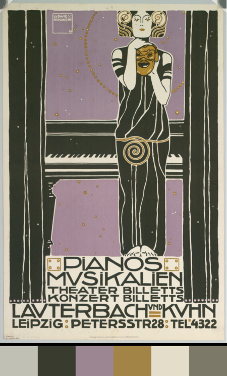

A poster by the artist Ludwig Hohlwein, accompanied by the color palette
information extracted through the processes described in this notebook.
*PIANOS; MUSIKALIEN; THEATER BILLETTS; KONZERT BILLETTS; LAUTERBACH UND
KUHN; LEIPZIG by Hohlwein, Ludwig - 1896 - The Albertina Museum Vienna,
Austria https://www.europeana.eu/en/item/15508/DG2003_2043. Modified by
author.*

Introduction
------------

In this tutorial, we will leverage Europeana APIs to gather data about
and analyze various Art Nouveau posters. We will interact with the APIs
using
`PyEuropeana <https://github.com/europeana/rd-europeana-python-api>`__,
a Python interface that abstracts away the internal workings of the API
and allows for a more seamless integration with the Python ecosystem. We
will then analyze the data that we gather using various packages from
the Python ecosystem. More specifically, we will be asking the following
question:

   **Can we extract representative color information from Art Nouveau
   posters?**

Background information
~~~~~~~~~~~~~~~~~~~~~~

When it comes to the perfect blend of beauty and function, perhaps no
one can quite beat the masterful posters and prints that were produced
during the *fin de siècle*: the time period that marks the end of the
19th century and the beginning of the 20th century. This lucrative
period, sadly followed by four decades of worldwide war and destruction,
gave us remarkable works of art belonging to movements like
`Symbolism <https://en.wikipedia.org/wiki/Symbolism_(arts)>`__ and `Art
Nouveau <https://en.wikipedia.org/wiki/Art_Nouveau>`__.

Art Nouveau posters and prints can be identified by many different
visual qualities: sleek and organic geometries, symbolism that takes
inspiration from nature, and the masterful use of color palettes, both
rich and constrained alike. As Art Nouveau is a well-known and
well-studied period in art history, it is easy to encounter many
scholarly articles that delve into one or more of its visual qualities.
However, coming across studies that do the same using computational
methods is hard. Finding tutorials that show you how that can be done is
even harder. Where might one even find all these posters to begin with?

Europeana offers access to a wide range of digitized representations of
cultural heritage objects, aggregated from the archives of the museums
found all throughout Europe. The Art Nouveau posters of the 19th/20th
century are only a small subset of these cultural heritage objects.
These posters can be accessed by using `Europeana’s online search
interface <https://www.europeana.eu/en/search?page=1&qf=TYPE%3A%22IMAGE%22&qf=MIME_TYPE%3Aimage%2Fjpeg&query=Art%20Nouveau&view=grid>`__.
The capabilities of the online search interface are limited when
compared to the Search API service that Europeana offers. While the
former allows you to search Europeana’s data in an easily approachable
way, the latter allows you to create more complex queries in a
programmatic fashion.

What are the goals of this tutorial?
~~~~~~~~~~~~~~~~~~~~~~~~~~~~~~~~~~~~

The goals of this tutorial are twofold:

-  To introduce Europeana’s Search API using the PyEuropeana package.
-  To inspire the reader about the things that can be done by using
   Europeana’s vast Cultural Heritage Object (CHO) data and metadata.

Who is this tutorial for?
~~~~~~~~~~~~~~~~~~~~~~~~~

This tutorial might interest anyone who is interested in using digital
images as the subject of quantitative, computational analysis. More
specifically, it can interest:

-  Data scientists that are interested in image analysis
-  Machine learning engineers that work with computer vision (see the
   `Saint George on a
   Bike <https://www.youtube.com/watch?v=ZbUEs0SULKQ&t=154s>`__ project)
-  Digital humanists (see the work of `Lev
   Manovich <http://lab.culturalanalytics.info/>`__)
-  Art historians
-  Quantitative social scientists
-  Computational artists (see `Electric Dreams of
   Ukiyo <http://www.obvious-art.com/ukiyo/>`__)

What do I need to know before following along?
~~~~~~~~~~~~~~~~~~~~~~~~~~~~~~~~~~~~~~~~~~~~~~

We aimed to make this tutorial very approachable. It does not require a
deep knowledge in any of the subjects that it intersects. However, we
asume an elementary level of familiarity with the following technologies
and concepts:

-  Python
-  Python packages such as NumPy, Pandas, Pillow and SciKit Learn
-  The digital representation of images
-  Basic statistics

Setup
-----

Importing the required packages
~~~~~~~~~~~~~~~~~~~~~~~~~~~~~~~

Among the packages that we will be using today are
`NumPy <https://numpy.org/>`__, `Pandas <https://pandas.pydata.org/>`__,
`Pillow (PIL) <https://pillow.readthedocs.io/en/stable/>`__,
`Scikit-learn <https://scikit-learn.org/stable/>`__ and
`PyEuropeana <https://github.com/europeana/rd-europeana-python-api>`__.
We will use NumPy so that we can vectorize certain computations and get
a speed boost. Pandas will be used to manipulate the vast amount of data
and metadata we get from the Europeana API’s. We will use an
unsupervised machine learning algorithm from Scikit-learn known as
*K-means clustering* to extract color palettes from individual images.
PyEuropeana, our Python wrapper around Europeana API’s, will be used to
fetch data from Europeana.

.. code:: python

    import os
    from pathlib import Path
    
    import numpy as np
    import pandas as pd
    import matplotlib as mpl
    import matplotlib.pyplot as plt
    from skimage import color, util
    from sklearn import cluster
    import PIL as pil
    
    import pyeuropeana.apis as apis # The Europeana APIs that we will be using today
    import pyeuropeana.utils as utils # The utility functions of the pyeuropeana package

Configuring Matplotlib presets
~~~~~~~~~~~~~~~~~~~~~~~~~~~~~~

This section contains the configuration required for the data
visualizations that appear in this notebook and can be ignored.

.. code:: python

    # Figure
    mpl.rcParams["figure.facecolor"] = "1A1C1A"
    mpl.rcParams["figure.edgecolor"] = "1A1C1A"
    
    # Axes
    mpl.rcParams["axes.facecolor"] = "1A1C1A"
    mpl.rcParams["axes.edgecolor"] = "DBDDDB"
    mpl.rcParams["axes.labelcolor"] = "DBDDDB"
    
    # Ticks
    mpl.rcParams["xtick.color"] = "DBDDDB"
    mpl.rcParams["ytick.color"] = "DBDDDB"
    
    # Typography
    mpl.rcParams["font.family"] = "Arial"
    mpl.rcParams["font.size"] = 12
    mpl.rcParams["text.color"] = "DBDDDB"

Setting the environment variables
~~~~~~~~~~~~~~~~~~~~~~~~~~~~~~~~~

What PyEuropeana does under the hood is sending HTTP requests formatted
in a certain way to the Europeana API endpoints. Each request has to be
signed with an API key to track usage and permissions. Therefore, before
starting to use PyEuropeana, we need to get an API key. You can get
yours `here <https://pro.europeana.eu/page/get-api>`__.

The functions that we call from PyEuropeana look into your environment
variables to find your API key. If you wish to run this notebook
locally, you need to provide your own environment key as an environment
variable titled ``EUROPEANA_API_KEY``. You can do so using the command
line or using a config file. Alternatively, in a Notebook environment or
in a Python script you can modify the code snippet as outlined below:

::

   os.environ['EUROPEANA_API_KEY'] = 'YOUR_API_KEY_HERE' #please insert your api key in between ''

Fetching data
-------------

A brief introduction to Europeana APIs
~~~~~~~~~~~~~~~~~~~~~~~~~~~~~~~~~~~~~~

Europeana offers various API endpoints that allow you to interact with
the data that it aggregates in different ways. Detailed information
about the APIs that Europeana offers can be found in the `API
documentation here <https://pro.europeana.eu/page/apis>`__.

Some of these APIs can be accessed directly via Python using the
PyEuropeana package. These APIs are:

-  The `Search API <https://pro.europeana.eu/page/search>`__: The Search
   API provides a way to search for metadata records and media on the
   Europeana repository. Much like on the Europeana website, you can
   search for keywords aswell as construct complicated queries using a
   plethora of filters.
-  The `Record API <https://pro.europeana.eu/page/record>`__: The Record
   API allows you to get the full metadata that Europeana has about a
   **Cultural Heritage Object (CHO)**. Metadata is, briefly explained,
   the data that you have about a piece of data. `The Europeana Data
   Model (EDM) <https://pro.europeana.eu/page/edm-documentation>`__
   considers the digitized version of a real, physical cultural artifact
   (or a digital-born cultural artifact) as a Cultural Heritage Object.
   The pieces of data that describe a CHO (its title, its provider, its
   location, its author(s), the link to its digital form) are considered
   as metadata.
-  The `Entity API <https://pro.europeana.eu/page/entity>`__: The Entity
   API allows you to search among the named entities that Europeana
   maintains and recognizes. These named entities can be many things,
   but the chief categories are **people**, **topics** and **places**
-  The `IIIF APIs <https://pro.europeana.eu/page/iiif>`__

We will be making use of the **Search API** primarily in this tutorial.

Basic queries with the ``apis.search()`` function
~~~~~~~~~~~~~~~~~~~~~~~~~~~~~~~~~~~~~~~~~~~~~~~~~

To make a request to Europeana’s Search API using Python, we can use the
``search()`` function of the ``apis`` module. This function requires passing as an 
argument a search term string to the parameter ``query`` at minimum. 
It returns a dictionary which contains metadata about the HTTP request and the actual
CHO data.

Let’s call the ``apis.search()`` function with the string “Art Nouveau
Poster” passed in as an argument to the parameter ``query``.

.. code:: python

    response = apis.search(
      query="Art Nouveau Poster"
    )

Working with raw responses
~~~~~~~~~~~~~~~~~~~~~~~~~~

We can inspect the ``response`` variable to see in-depth what it
contains.

.. code:: python

    print(type(response)) # apis.search() returns a dictionary
    print(response.keys()) # the response has metadata about the HTTP request and the actual data about CHOs
    print(response["apikey"]) # the key with which the HTTP request was authenticated
    print(response["success"]) # the success status of the HTTP request
    print(response["itemsCount"]) # the number of CHO objects fetched by the HTTP request
    print(response["totalResults"]) # the number of CHO objects that matched with the provided query

.. parsed-literal::

    <class 'dict'>
    dict_keys(['apikey', 'success', 'requestNumber', 'itemsCount', 'totalResults', 'nextCursor', 'items', 'url', 'params'])
    api2demo
    True
    12
    520
    

The keys of our ``response`` dictionary are pretty explanatory for the
most part. Below are the explanations for some of its keys:

-  The ``apikey`` key holds information about the key with which the
   HTTP request was authenticated.
-  The ``success`` key holds information about the success status of the
   HTTP request.
-  The ``itemsCount`` key holds information about the number of CHOs
   fetched by the HTTP request.
-  The ``totalResults`` key holds information about the number of CHOs
   that matched with the provided query.
-  The ``url`` key holds information about the formatted HTTP request
   that was made to the Europeana’s Search API endpoint.
-  The ``params`` key records the arguments and parameters that were
   passed to the ``apis.search()`` function.

While these keys hold the metadata about the HTTP request that was made,
the ``items`` key holds the actual data that was returned as part of the
request. The value of the ``items`` key is a list of dictionaries. Each
dictionary represents the metadata and data about one of the CHOs
matched by the query. These dictionaries have many keys whose values can
be strings, numeric types, booleans or even other iterables.

.. code:: python

    print(type(response["items"])) # response["items"] is a list of dictionaries
    print(len(response["items"]) == response["itemsCount"]) # the itemsCount key captures how many dictionaries there are in the items list
    print(response["items"][0].keys())
    print(len(response["items"][0].keys()))

.. parsed-literal::

    <class 'list'>
    True
    dict_keys(['completeness', 'country', 'dataProvider', 'dcCreator', 'dcCreatorLangAware', 'dcTitleLangAware', 'edmConcept', 'edmConceptLabel', 'edmConceptPrefLabelLangAware', 'edmDatasetName', 'edmIsShownAt', 'edmPreview', 'edmTimespanLabel', 'edmTimespanLabelLangAware', 'europeanaCollectionName', 'europeanaCompleteness', 'guid', 'id', 'index', 'language', 'link', 'previewNoDistribute', 'provider', 'rights', 'score', 'timestamp', 'timestamp_created', 'timestamp_created_epoch', 'timestamp_update', 'timestamp_update_epoch', 'title', 'type', 'ugc', 'year'])
    34
    

The metadata that Europeana aggregates about each cultural heritage
object is comprehensive and nested in structure. Here, we can see the
full metadata for the first CHO retrieved by our query.

.. code:: python

    for key, value in response["items"][0].items():
      print(key, value)

.. parsed-literal::

    completeness 7
    country ['Netherlands']
    dataProvider ['National Library of the Netherlands - Koninklijke Bibliotheek']
    dcCreator ['Elffers,Dick,']
    dcCreatorLangAware {'def': ['Elffers,Dick,']}
    dcTitleLangAware {'def': ['art nouveau jugenstil nieuwe kunst kunstnijverheid aanwinsten rijksmusem 15 april 16 juli 72 amsterdam']}
    edmConcept ['http://data.europeana.eu/concept/base/49', 'http://data.europeana.eu/concept/base/42']
    edmConceptLabel [{'def': 'Plakat'}, {'def': 'Lithografie'}, {'def': 'Plakat'}, {'def': 'Litografi'}, {'def': 'Плакат'}, {'def': 'Литография'}, {'def': 'Плакат'}, {'def': 'Літаграфія'}, {'def': 'Juliste'}, {'def': 'Litografia'}, {'def': 'Cartaz'}, {'def': 'Litografia'}, {'def': 'Плакат'}, {'def': 'Литография'}, {'def': 'Afiša'}, {'def': 'Litografija'}, {'def': 'Plakāts'}, {'def': 'Litogrāfija'}, {'def': 'Plakat'}, {'def': 'Litografija'}, {'def': 'Affiche'}, {'def': 'Lithographie'}, {'def': 'Plakát'}, {'def': 'Litográfia'}, {'def': 'Плакат'}, {'def': 'Літографія'}, {'def': 'პოსტერი'}, {'def': 'Plagát'}, {'def': 'Litografia'}, {'def': 'Plakat'}, {'def': 'Litografija'}, {'def': 'Póstaer'}, {'def': 'Плакат'}, {'def': 'Cartell'}, {'def': 'Litografia'}, {'def': 'Плакат'}, {'def': 'Литографија'}, {'def': 'Affisch'}, {'def': 'Litografi'}, {'def': '포스터'}, {'def': '석판 인쇄'}, {'def': 'Cartel'}, {'def': 'Litografía'}, {'def': 'Αφίσα'}, {'def': 'Λιθογραφία'}, {'def': 'Poster'}, {'def': 'Lithography'}, {'def': 'Manifesto (stampato)'}, {'def': 'Litografia'}, {'def': 'Cartel'}, {'def': 'Litografía'}, {'def': '海報'}, {'def': '平版印刷'}, {'def': 'Plakát'}, {'def': 'Litografie'}, {'def': 'Kartel (komunikazioa)'}, {'def': 'ملصق'}, {'def': 'طباعة حجرية'}, {'def': 'ポスター'}, {'def': 'リトグラフ'}, {'def': 'Poster'}, {'def': 'Plakat'}, {'def': 'Litografia'}, {'def': 'כרזה'}, {'def': 'הדפס אבן'}, {'def': 'Plakat'}, {'def': 'Litografi'}, {'def': 'Poster'}, {'def': 'Litografie'}, {'def': 'Poster (kunst)'}, {'def': 'Lithografie'}, {'def': 'Afiş'}, {'def': 'Taş baskı'}, {'def': 'Litografija'}, {'def': 'Shtypi litografik'}, {'def': 'Litograafia'}]
    edmConceptPrefLabelLangAware {'de': ['Lithografie', 'Plakat'], 'no': ['Litografi', 'Plakat'], 'ru': ['Плакат', 'Литография'], 'be': ['Плакат', 'Літаграфія'], 'fi': ['Litografia', 'Juliste'], 'pt': ['Litografia', 'Cartaz'], 'bg': ['Плакат', 'Литография'], 'lt': ['Afiša', 'Litografija'], 'lv': ['Litogrāfija', 'Plakāts'], 'hr': ['Litografija', 'Plakat'], 'fr': ['Affiche', 'Lithographie'], 'hu': ['Plakát', 'Litográfia'], 'bs': ['Litografija'], 'uk': ['Літографія', 'Плакат'], 'ka': ['პოსტერი'], 'sk': ['Litografia', 'Plagát'], 'sl': ['Litografija', 'Plakat'], 'ga': ['Póstaer'], 'mk': ['Плакат'], 'ca': ['Cartell', 'Litografia'], 'sq': ['Shtypi litografik'], 'sr': ['Литографија', 'Плакат'], 'sv': ['Affisch', 'Litografi'], 'ko': ['석판 인쇄', '포스터'], 'gl': ['Cartel', 'Litografía'], 'el': ['Λιθογραφία', 'Αφίσα'], 'en': ['Lithography', 'Poster'], 'it': ['Manifesto (stampato)', 'Litografia'], 'es': ['Cartel', 'Litografía'], 'zh': ['海報', '平版印刷'], 'et': ['Litograafia'], 'cs': ['Litografie', 'Plakát'], 'eu': ['Kartel (komunikazioa)'], 'ar': ['طباعة حجرية', 'ملصق'], 'ja': ['ポスター', 'リトグラフ'], 'az': ['Poster'], 'pl': ['Litografia', 'Plakat'], 'he': ['הדפס אבן', 'כרזה'], 'da': ['Litografi', 'Plakat'], 'ro': ['Litografie', 'Poster'], 'nl': ['Lithografie', 'Poster (kunst)'], 'tr': ['Taş baskı', 'Afiş']}
    edmDatasetName ['92034_Ag_EU_TEL']
    edmIsShownAt ['http://www.geheugenvannederland.nl/?/en/items/RA01:3005100197950620454add1']
    edmPreview ['https://api.europeana.eu/thumbnail/v2/url.json?uri=http%3A%2F%2Fresolver.kb.nl%2Fresolve%3Furn%3Durn%3Agvn%3ARA01%3A3005100197950620454add1%26role%3Dthumbnail&type=IMAGE']
    edmTimespanLabel [{'def': 'Second millenium AD'}, {'def': 'Second millenium AD, years 1001-2000'}, {'def': 'Late 20th century'}, {'def': '20th century'}, {'def': '20-th'}, {'def': '20th'}, {'def': '20th century'}, {'def': '2e millénaire après J.-C.'}, {'def': 'XXe siècle'}, {'def': '20e siècle'}, {'def': '1972'}, {'def': '20..'}, {'def': '20??'}, {'def': '20e'}, {'def': 'Конец 20-го века'}, {'def': 'XX век'}, {'def': '20й век'}, {'def': '20. Jahrhundert'}, {'def': '1900-luku'}, {'def': 'século XX'}, {'def': '20 век'}, {'def': 'XX amžius'}, {'def': '20. gadsimts'}, {'def': '20. stoljeće'}, {'def': '20. század'}, {'def': '20. storočie'}, {'def': '20. stoletje'}, {'def': '20ú haois'}, {'def': 'segle XX'}, {'def': '1900-talet'}, {'def': '20ός αιώνας'}, {'def': 'XX secolo'}, {'def': 'siglo XX'}, {'def': '20. sajand'}, {'def': '20. století'}, {'def': 'XX wiek'}, {'def': 'Secolul al XX-lea'}, {'def': '20. århundrede'}, {'def': '20e eeuw'}, {'def': '20de eeuw'}, {'def': 'http://id.nlm.nih.gov/mesh/D049673'}, {'def': 'http://vocab.getty.edu/aat/300404514'}, {'def': 'http://id.loc.gov/authorities/names/sh2002012476'}, {'def': 'http://id.loc.gov/authorities/names/sh85139020'}, {'def': 'http://www.wikidata.org/entity/Q6927'}, {'def': 'http://semium.org/time/19xx'}]
    edmTimespanLabelLangAware {'de': ['20. Jahrhundert'], 'ru': ['Конец 20-го века', 'XX век', '20й век'], 'fi': ['1900-luku'], 'def': ['1972', '20..', '20??', '20e'], 'pt': ['século XX'], 'bg': ['20 век'], 'lt': ['XX amžius'], 'lv': ['20. gadsimts'], 'hr': ['20. stoljeće'], 'fr': ['2e millénaire après J.-C.', 'XXe siècle', '20e siècle'], 'hu': ['20. század'], 'sk': ['20. storočie'], 'sl': ['20. stoletje'], 'ga': ['20ú haois'], 'ca': ['segle XX'], 'sv': ['1900-talet'], 'el': ['20ός αιώνας'], 'en': ['Second millenium AD', 'Second millenium AD, years 1001-2000', 'Late 20th century', '20th century', '20-th', '20th', '20th century'], 'it': ['XX secolo'], 'es': ['siglo XX'], 'et': ['20. sajand'], 'cs': ['20. století'], 'pl': ['XX wiek'], 'ro': ['Secolul al XX-lea'], 'da': ['20. århundrede'], 'nl': ['20e eeuw', '20de eeuw']}
    europeanaCollectionName ['92034_Ag_EU_TEL']
    europeanaCompleteness 7
    guid https://www.europeana.eu/item/92034/GVNRC_RA01_3005100197950620454add1?utm_source=api&utm_medium=api&utm_campaign=api2demo
    id /92034/GVNRC_RA01_3005100197950620454add1
    index 0
    language ['nl']
    link https://api.europeana.eu/record/92034/GVNRC_RA01_3005100197950620454add1.json?wskey=api2demo
    previewNoDistribute False
    provider ['The European Library']
    rights ['http://rightsstatements.org/vocab/InC/1.0/']
    score 17.870651
    timestamp 1635453213080
    timestamp_created 2014-01-10T01:29:29.693Z
    timestamp_created_epoch 1389317369693
    timestamp_update 2018-04-05T17:39:35.417Z
    timestamp_update_epoch 1522949975417
    title ['art nouveau jugenstil nieuwe kunst kunstnijverheid aanwinsten rijksmusem 15 april 16 juli 72 amsterdam']
    type IMAGE
    ugc [False]
    year ['1972']
    

Using utility functions to transform and enrich raw responses
~~~~~~~~~~~~~~~~~~~~~~~~~~~~~~~~~~~~~~~~~~~~~~~~~~~~~~~~~~~~~

Although you can work with this data in its raw form if you are
determined enough, you do not have to. PyEuropeana comes with a set of
utility functions that can be leveraged to shape the response data of a
Search API call into a friendlier form. The function ``search2df`` of
the ``utils`` module does exactly this. This utility function can be used to transform the
output of the ``apis.search()`` function into a `Pandas DataFrame <https://pandas.pydata.org/docs/reference/api/pandas.DataFrame.html>`__,
a data structure that is very common in the Python ecosystem.

The function ``utils.search2df`` has only two parameters: ``response``
and ``full``. The parameter ``full`` is set to ``False`` by default, and
thus the default behavior of the function is to include only the columns
that we believe will be the most relevant for all users.

.. code:: python

    response = utils.search2df(
        response,
        full=False
    )
    
    print(type(response)) # response is now a dataframe that we can freely manipulate using standard Pandas functions and methods.

.. parsed-literal::

    <class 'pandas.core.frame.DataFrame'>
    

Now that ``response`` is a DataFrame, we can freely manipulate it using
standard Pandas functions and methods.

Let’s first take a look at what kinds of information the
``utils.search2df()`` function preserved.

.. code:: python

    print(response.shape) # the dataframe consists of 12 rows and 16 columns.
    print(response.columns)
    print(response.loc[0, :])
    print(response.loc[0, "uri"])

.. parsed-literal::

    (12, 16)
    Index(['europeana_id', 'uri', 'type', 'image_url', 'country', 'description',
           'title', 'creator', 'language', 'rights', 'provider', 'dataset_name',
           'concept', 'concept_lang', 'description_lang', 'title_lang'],
          dtype='object')
    europeana_id                /92034/GVNRC_RA01_3005100197950620454add1
    uri                 http://data.europeana.eu/item/92034/GVNRC_RA01...
    type                                                            IMAGE
    image_url                                                        None
    country                                                   Netherlands
    description                                                      None
    title               art nouveau jugenstil nieuwe kunst kunstnijver...
    creator                                                 Elffers,Dick,
    language                                                           nl
    rights                     http://rightsstatements.org/vocab/InC/1.0/
    provider            National Library of the Netherlands - Koninkli...
    dataset_name                                          92034_Ag_EU_TEL
    concept                      http://data.europeana.eu/concept/base/49
    concept_lang        {'de': 'Lithografie', 'no': 'Litografi', 'ru':...
    description_lang                                                 None
    title_lang          {'def': 'art nouveau jugenstil nieuwe kunst ku...
    Name: 0, dtype: object
    http://data.europeana.eu/item/92034/GVNRC_RA01_3005100197950620454add1
    

The ``utils.search2df()`` function only reduces the total number of
columns/dictionary keys (from 34 to 16) and does not touch the total
number of rows, as advertised. Among the important information it
preserves are the information about the CHO’s internal Europeana ID, its
URI, its type and its image URL.

The image URL is especially important for our use case, because we will
shortly be using those URLs to get the actual images loaded into our
Python environment. Before that, let’s tidy up our DataFrame a little
bit. We will preserve information about id, type, image URL, title and
creator. We will also drop any rows that do not have data in the
``image_url`` column along with the rows that have duplicate titles.

.. code:: python

    response = (
        response
        .loc[:, ["europeana_id", "image_url", "type", "title", "creator"]]
        .dropna(axis=0)
        .drop_duplicates(subset="title")
        .reset_index(drop=True)
    )

.. code:: python

    response

.. raw:: html

    
      

        

          

    
    <table border="1" class="dataframe">
      <thead>
        <tr style="text-align: right;">
          <th></th>
          <th>europeana_id</th>
          <th>image_url</th>
          <th>type</th>
          <th>title</th>
          <th>creator</th>
        </tr>
      </thead>
      <tbody>
        <tr>
          <th>0</th>
          <td>/9200495/yoolib_inha_3664</td>
          <td>http://tools.yoolib.net/i/s4/inha/files/3001-4...</td>
          <td>IMAGE</td>
          <td>[Salon des Cent. Janvier 1898]</td>
          <td>Causé, Emil (1867-19??)</td>
        </tr>
        <tr>
          <th>1</th>
          <td>/92002/BibliographicResource_1000093325536_source</td>
          <td>http://www.theeuropeanlibrary.org/images/treas...</td>
          <td>IMAGE</td>
          <td>Baltic artists' painting exhibition</td>
          <td>Borchert, Bernhard</td>
        </tr>
        <tr>
          <th>2</th>
          <td>/92002/BibliographicResource_1000093325505_source</td>
          <td>http://www.theeuropeanlibrary.org/images/treas...</td>
          <td>IMAGE</td>
          <td>The Olympic Games</td>
          <td>Hjortzberg, Olle</td>
        </tr>
        <tr>
          <th>3</th>
          <td>/92002/BibliographicResource_1000093325434_source</td>
          <td>http://www.theeuropeanlibrary.org/images/treas...</td>
          <td>IMAGE</td>
          <td>Latvijas precu izstade</td>
          <td>Steinbergs, Oskars</td>
        </tr>
        <tr>
          <th>4</th>
          <td>/2064108/Museu_ProvidedCHO_Kunstbibliothek__St...</td>
          <td>http://www.smb-digital.de/eMuseumPlus?service=...</td>
          <td>IMAGE</td>
          <td>L'Art Nouveau. Exposition permamente</td>
          <td>Félix Vallotton (28.12.1865 - 29.12.1925, Entw...</td>
        </tr>
      </tbody>
    </table>
    

          <button class="colab-df-convert" onclick="convertToInteractive('df-11d11ef8-b886-4053-9fce-a24c487be5ad')"
                  title="Convert this dataframe to an interactive table."
                  style="display:none;">
    
      <svg xmlns="http://www.w3.org/2000/svg" height="24px"viewBox="0 0 24 24"
           width="24px">
        <path d="M0 0h24v24H0V0z" fill="none"/>
        <path d="M18.56 5.44l.94 2.06.94-2.06 2.06-.94-2.06-.94-.94-2.06-.94 2.06-2.06.94zm-11 1L8.5 8.5l.94-2.06 2.06-.94-2.06-.94L8.5 2.5l-.94 2.06-2.06.94zm10 10l.94 2.06.94-2.06 2.06-.94-2.06-.94-.94-2.06-.94 2.06-2.06.94z"/><path d="M17.41 7.96l-1.37-1.37c-.4-.4-.92-.59-1.43-.59-.52 0-1.04.2-1.43.59L10.3 9.45l-7.72 7.72c-.78.78-.78 2.05 0 2.83L4 21.41c.39.39.9.59 1.41.59.51 0 1.02-.2 1.41-.59l7.78-7.78 2.81-2.81c.8-.78.8-2.07 0-2.86zM5.41 20L4 18.59l7.72-7.72 1.47 1.35L5.41 20z"/>
      </svg>
          </button>
    
      
    
          
        

      

    

Now that we have a tidier and more concise DataFrame, we can start
enriching it by loading the actual image data. Recall that the column
``image_url`` contained URLs through which we can fetch individual
images. We can test whether this statement holds by taking one URL and
using any browser we want to access it. You can copy the output of the
cell below to do exactly that.

.. code:: python

    print(response.loc[4, "image_url"])

.. parsed-literal::

    http://www.smb-digital.de/eMuseumPlus?service=ImageAsset&module=collection&objectId=1829993&resolution=superImageResolution#4301743
    

In principle, any Python code that makes a HTTP GET request to these
URLs and then processes the response can be used to get the image data
loaded into our Python environment. PyEuropeana has a utility function
that does exactly that. The function ``utils.url2img()`` uses the
`urllib <https://docs.python.org/3/library/urllib.html>`__ module of the
standard library and Pillow (PIL) to do exactly that.

The
``utils.url2img`` function accepts an URL as an argument and returns a ``PIL.image`` object.

.. code:: python

    test_image = utils.url2img(response.loc[4, "image_url"])
    print(type(test_image))

.. parsed-literal::

    <class 'PIL.Image.Image'>
    

.. code:: python

    test_image.reduce(2) # Display the image, scaled by 0.50

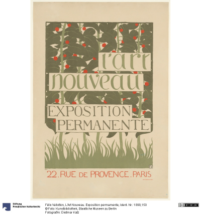

We now know how to query Europeana to get data and metadata about the
CHOs that we want. We’ve also seen how we can manipulate and enrich the
raw response that we get from the API call using utility functions.

Despite all this, our initial query can still use some work. The
response that we got from the API call included some redundant data and
we had to “clean” up a little by dropping the CHOs that did not have an
image data. Perhaps we can avoid having to do so and get more relevant
data if we modify our initial query.

Advanced queries with the ``apis.search() function``
~~~~~~~~~~~~~~~~~~~~~~~~~~~~~~~~~~~~~~~~~~~~~~~~~~~~

The only argument that we passed into the ``apis.search()`` function was
the string ``"Art Nouveau Poster"`` for the ``query=...`` parameter. If
you took a look at the API docs for the ``apis.search()``
function, you probably noticed that the function has many other parameters besides
``query``. These parameters allow you to send to the API a carefully
crafted query. Through them, you get more relevant data that requires
less processing on your end. When you utilize these parameters you can
match or even exceed the full expressiveness of the online search
interface.

`The Search API documentation located in Europeana API
docs <https://pro.europeana.eu/page/search>`__ contains more information
about what the many possible parameters are. When combined with the
Python API docs we’ve just linked above, you have all the documentation
you need to craft a precise query.

Let’s now try to refine our initial query by utilizing more of the
parameters that we have in our disposal. We will try to fetch the
graphic works (posters, prints, advertisements) of prominent Art Nouveau
artists from Continental Europe. The list of artists whose works we will
try to search for were taken from `this Wikipedia
page <https://en.wikipedia.org/wiki/Art_Nouveau_posters_and_graphic_arts>`__.

.. code:: python

    response = apis.search(
      query="""
      who:(
      "Henri de Toulouse-Lautrec" OR "Jules Chéret" OR "Eugène Samuel Grasset" OR "Mucha" OR "Steinlen" OR "Berthon" OR "Livemont" OR "Meunier"
      OR "Sattler" OR "Eckmann" OR "Witzel" OR "Klimt" OR "Roller" OR "Kurzweil" OR "Andri" OR "Moser" OR "Zeymer" OR "Hohlwein"
      )
      """,
      qf='what:(Poster OR Print OR Engraving OR Illustration OR Lithograph)',
      reusability="open AND permission",
      media=True,
      landingpage=True,
      profile="rich",
      sort="europeana_id",
      rows=750
    )
    

The query above contains parameters that are well-explained in the API
docs (such as ``rows`` and ``media``) aswell as some confusing ones.)
Let’s try to clarify it a little:

-  The multi-line string that we passed into the ``query`` parameter is
   formatted as specified by the `Search API syntax document
   here <https://pro.europeana.eu/page/search#syntax>`__. We are using
   an OR statement to specificy that we want to match multiple keywords.

-  The ``who:(...)`` prefix of the query string is an aggregated search
   field. Europeana Search API has `a whole list of search
   fields <https://pro.europeana.eu/page/search#search-fields>`__ that
   you can pass in either into the ``query`` parameter or the ``qf``
   parameter. The aggregated search field ``who`` here allows us to
   search for CHO data based on their authors.

-  The ``query`` parameter receives a long Python string that is
   basically the name of the artists we want to search for. Pay
   attention to how we can search for full names (Henri de
   Toulouse-Lautrec) aswell as for surnames only (Klimt). A string like
   this can be easily generated programmatically.

-  We are using the ``qf`` parameter to refine our inital search.
   ``what:(...)`` is another aggregate search field that allows you to
   search CHO data based on topic. The topics that we specified here
   were taken `from this page about topics recognized by
   Europeana <https://www.europeana.eu/en/collections/topics>`__.

As with the previous query, the response of this API call is a nested
dictionary that can be transformed into a DataFrame and enriched using
our utility methods. The code snippet below is an aggregation of all the
same steps we’ve used for our previous query. As an extra we are using
``Series.apply()`` from Pandas to cast our ``utils.url2img()`` function
to each row. We are also checking for duplicates based on titles and
dropping duplicate items along with rows that we could not manage to get
data for.

.. code:: python

    # transform the response dictionary to a dataframe
    response = utils.search2df(response, full=False)
    
    # format and tidy up the dataframe
    response = (
        response
        .loc[:, ["europeana_id", "image_url", "title", "creator"]]
        .dropna(axis=0)
        .drop_duplicates(subset=["title", "europeana_id"])
        .reset_index(drop=True)
    )
    
    # enrich the dataframe w/ image data
    response["image"] = response["image_url"].apply(utils.url2img)
    
    # tidy up the dataframe again: drop the `image_url` column and image request failures
    response = (
        response
        .loc[:, ["image", "europeana_id", "title", "creator"]]
        .dropna(axis=0)
        .reset_index(drop=True)
    )

Let’s take a look at the DataFrame that we’ve created to try and
understand our small dataset better. We can start by looking at the
general shape of the DataFrame and at the data types of its columns.

.. code:: python

    print(response.shape) # we have around 240 rows and 4 columns
    print(response.info()) # all columns have non-numeric data, no rows with duplicate values

.. parsed-literal::

    (242, 4)
    <class 'pandas.core.frame.DataFrame'>
    RangeIndex: 242 entries, 0 to 241
    Data columns (total 4 columns):
     #   Column        Non-Null Count  Dtype 
    ---  ------        --------------  ----- 
     0   image         242 non-null    object
     1   europeana_id  242 non-null    object
     2   title         242 non-null    object
     3   creator       242 non-null    object
    dtypes: object(4)
    memory usage: 7.7+ KB
    None
    

Since we based our search off of a list of artists, it might be a good
idea to also look at how many graphic works we have per artist.

.. code:: python

    response["creator"].value_counts()

.. parsed-literal::

    #Ludwig_Hohlwein_Künstler_in                      38
    #Koloman_Moser_Künstler_in                        24
    #Jules_Chéret_Künstler_in                         22
    #Alfred_Roller_Künstler_in                        18
    #Théophile_Alexandre_Steinlen_Künstler_in         16
    Steinlen, Théophile-Alexandre                     15
    #Henri_de_Toulouse-Lautrec_Künstler_in            14
    #Alfons_Maria_Mucha_Künstler_in                   13
    #Josef_Rudolf_Witzel_Künstler_in                   7
    #Eugène_Samuel_Grasset_Künstler_in                 7
    #Georges_Meunier_Künstler_in                       7
    #Privat_Livemont_Künstler_in                       6
    Lithographische Anstalt Albert Berger              6
    #Henri_Meunier_Künstler_in                         5
    Mucha, Alphonse                                    4
    #Gustav_Klimt_Künstler_in                          4
    #Josef_Sattler_Künstler_in                         3
    Mucha, Alfons                                      3
    Meunier, Henri Georges                             2
    #Paul_Berthon_Künstler_in                          2
    http://data.europeana.eu/agent/base/155973         2
    Moser, Kolo                                        2
    http://data.europeana.eu/agent/base/45763          2
    #Koloman_Moser_Nachahmer_in_von                    1
    #Maximilian_Kurzweil_Künstler_in                   1
    #Ernst_Klimt_Künstler_in                           1
    #Otto_Eckmann_Künstler_in                          1
    Hohlwein, Ludwig (Entwerfer) (Entwurf)             1
    Roller, Emil                                       1
    Meunier, Henry                                     1
    Hohlwein, Ludwig                                   1
    Meunier, Jean-Baptiste                             1
    Meunier, Louis (1665) (Herstellung), 1665-1668     1
    Privat-Livemont, T.                                1
    Moser, Koloman                                     1
    Steinlen, Théophile Alexandre                      1
    Imprimerie F. Champenois                           1
    Livemont, Privat Antoine Théodore                  1
    Klimt, Gustav                                      1
    Lith. O. D                                         1
    http://data.europeana.eu/agent/base/37683          1
    Imprimerie Lemercier                               1
    #Henri_de_Toulouse-Lautrec_Nach                    1
    Name: creator, dtype: int64

It looks like we managed to get a good number of individual images for
most of the artists that we wanted to investigate. There are some
duplicate names in the list that can be worked with to further clean the
dataset, but we will not be doing that.

Lastly, let’s look at some of the images that we’ve loaded into our
Python environment. How about these posters drawn by `Henri
Meunier? <https://en.wikipedia.org/wiki/Henri_Meunier>`__

.. code:: python

    subset = response.loc[response["creator"] == "#Henri_Meunier_Künstler_in", "image"]
    for img in subset:
      display(img.reduce(4)) # scaled by 0.25

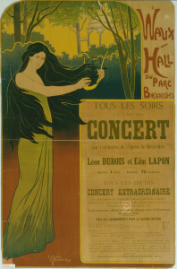

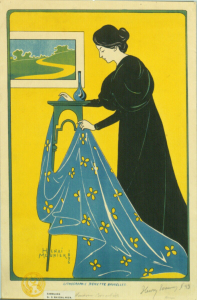

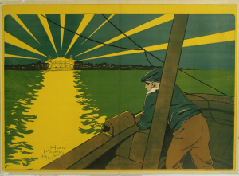

Everything looks in order! Now that we have a dataset of Art Nouveau
posters and prints we can work with, we can get on to analyzing them.

Extracting representative color information
-------------------------------------------

Let’s briefly remember our initial question:

   **Can we extract representative color information from Art Nouveau
   posters?**

Before going on and writing the Python code that accomplishes this in
one way, it may serve us well to really understand what we mean by this.

What’s in a poster?
~~~~~~~~~~~~~~~~~~~

For humans, **a poster is a specific kind of image that has both an
aesthethic and a semantic purpose.** For a digital computer **an image
is nothing more than a long series of ones and zeros.** These ones and
zeros, when read in a specific order and interpreted in a particular
way, contain the information that is needed to recreate the image on a
screen.

Our computer screens are (generally) made up very small clusters of
three lamps that emit red, green and blue light. The logical
representation of each of these clusters of lamps is called a
`pixel <https://en.wikipedia.org/wiki/Pixel>`__. A *pixel* is the basic
logical unit in computer graphics. The series of ones and zeroes can be
mapped to pixels and made to manifest on our screens. This means that
**every digital image can be represented as a collection of pixels.**
For those that want a more structured explanation:

-  An image is a set of n pixels.
-  Each pixel exists as a point in a 3D `color
   space <https://en.wikipedia.org/wiki/Color_space>`__.
-  This color space is generally the `RGB color
   space <https://en.wikipedia.org/wiki/RGB_color_spaces>`__.

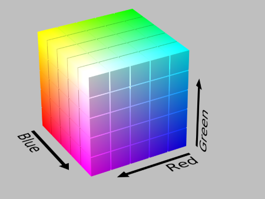

The RGB color cube.\ *By SharkD - Own work, CC BY-SA 3.0,
https://commons.wikimedia.org/w/index.php?curid=9803320*

-  The smallest value that each digit can take in that ordered triple is
   0, and the largest value is 255. For each color channel, 0 means **no
   color of that channel** and 255 means **full intensity.**

All this can be summarized in the following fashion. If we care only
about the color, a poster that looks like the image below for us…

.. code:: python

    display(subset.iloc[0].reduce(3))

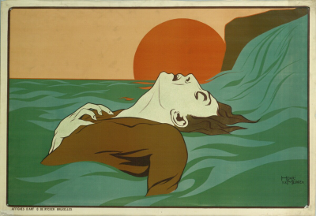

…looks more or less like this for a computer:

.. code:: python

    # --- data prep ---
    # get one of the images from subset as sample_poster
    sample_poster = subset.iloc[0]
    
    # convert to a df for more convenient plotting
    sample_poster_rawdata = np.array(sample_poster, dtype="uint8").reshape(-1, 3)
    sample_poster_df = pd.DataFrame(sample_poster_rawdata, columns = ["red_val", "green_val", "blue_val"])
    
    # add hexcode format for colors
    def rgb_to_hex(red, green, blue):
        """Return color as #rrggbb for the given color values."""
        return '#%02x%02x%02x' % (red, green, blue)
    
    sample_poster_df['hex'] = sample_poster_df.apply(lambda r: rgb_to_hex(*r), axis=1)
    
    # --- viz setup ---
    #create figure
    fig = plt.figure(figsize = (10.80, 10.80),
                     dpi = 100)
    ax = fig.add_subplot(1, 1, 1, projection="3d")
    
    # configure params
    # axis labels
    ax.set_xlabel("R Value",
                  fontsize=13,
                  fontweight="bold")
    
    ax.set_ylabel("G Value",
                  fontsize=13,
                  fontweight="bold")
    
    ax.set_zlabel("B Value",
                  fontsize=13,
                  fontweight="bold")
    
    
    # grid, spines and axes
    # set ax x, y, z lims
    ax.set_xlim(0, 250)
    ax.set_ylim(0, 250)
    ax.set_zlim(0, 250)
    #Make the panes transparent
    ax.xaxis.set_pane_color((1.0, 1.0, 1.0, 0.0))
    ax.yaxis.set_pane_color((1.0, 1.0, 1.0, 0.0))
    ax.zaxis.set_pane_color((1.0, 1.0, 1.0, 0.0))
    # make the grid lines transparent
    ax.xaxis._axinfo["grid"]['color'] =  "#DBDDDB22"
    ax.yaxis._axinfo["grid"]['color'] =  "#DBDDDB22"
    ax.zaxis._axinfo["grid"]['color'] =  "#DBDDDB22"
    # make the grid lines hatched
    ax.xaxis._axinfo["grid"]['linestyle'] =  "--"
    ax.yaxis._axinfo["grid"]['linestyle'] =  "--"
    ax.zaxis._axinfo["grid"]['linestyle'] =  "--"
    
    # 3D view
    ax.view_init(elev=25., azim=45.)
    
    # --- plotting ---
    scatter1 = ax.scatter(xs=sample_poster_df.loc[:, "red_val"].astype(int),
                          ys=sample_poster_df.loc[:, "green_val"].astype(int),
                          zs=sample_poster_df.loc[:, "blue_val"].astype(int),
                          s=10,
                          marker="o",
                          facecolors=sample_poster_df["hex"],
                          alpha=0.25)
    
    fig.show()
    

.. parsed-literal::

    findfont: Font family ['Arial'] not found. Falling back to DejaVu Sans.
    findfont: Font family ['Arial'] not found. Falling back to DejaVu Sans.
    

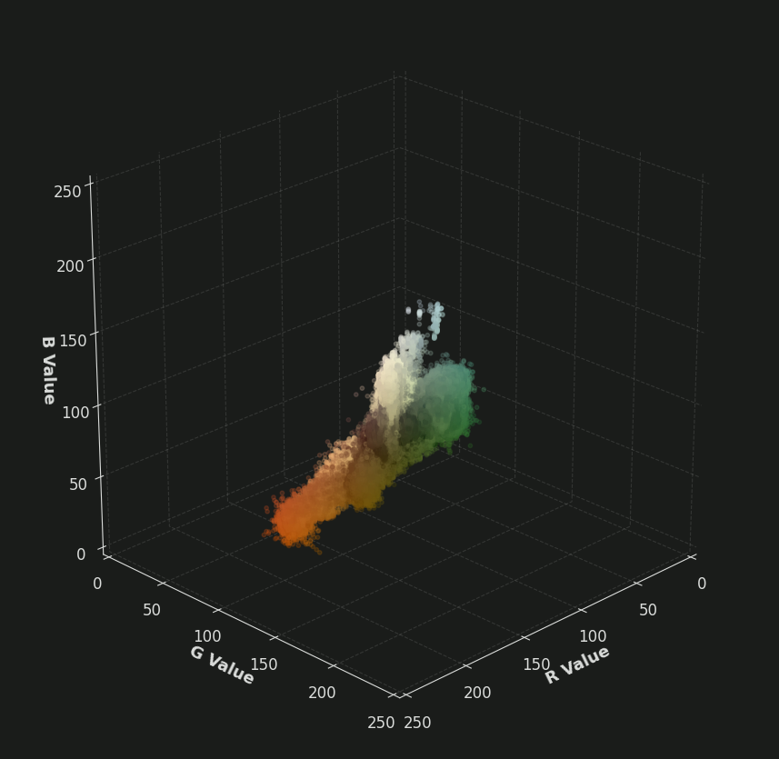

The 3D scatterplot above plots 985,200 individual points representing
all the pixels of our example poster in a 3D space. Seeing the image in
this form helps us to finally rephrase our problem. Our question can now
be transformed into the following:

   **Can we extract representative color information from separate
   collections of points in 3D space?**

The question is beginning to look a lot like something that a computer
can solve programmatically. Let’s keep attacking the question further.

How to pick representative colors?
~~~~~~~~~~~~~~~~~~~~~~~~~~~~~~~~~~

When faced with a visual scene, we humans can very easily point at the
colors that we deem to be dominant. For example, in the poster above one
might point at the dirty orange of the setting sun or the faded green of
the waves as being the “representative” colors. We seem to possess the
ability to extract from an image *K* colors we deem to be
“representative.” by using our own eyes. In fact, we have name for these
most “representative” or “important” colors. We call those the **color
palette** of an image.

How might we instruct a computer to do the same? If we take a peek at
the 3D scatterplot again, we can see that the individual points are
mostly aggregated or *clustered* around certain regions of the 3D RGB
space. This is the key insight behind solving our problem
programmatically. If we can somehow determine these clusters and their
centers, we can take the cluster centers and construct a representative
color palette.

Phrased this way, our question becomes the following:

   **Can we extract the individual cluster centers from separate
   collections of points in 3D space?**

Picking the appropriate algorithm
~~~~~~~~~~~~~~~~~~~~~~~~~~~~~~~~~

Luckily for us, we are not about to reinvent the wheel. `There is a
whole field of inquiry within Computer Science that deals with problems
related to
clustering <https://en.wikipedia.org/wiki/Cluster_analysis>`__. In fact,
the task of **trying to find the k colors that best represent an image
has also been studied.** We have a scholarly interest in the issue, but
this problem (actually called `Color
Quantization <https://en.wikipedia.org/wiki/Color_quantization>`__) has
been studied under the umbrella of digital image processing in order to
come up with a way to reduce the storage space of an image without
altering its appearance in a major way.

One way of reducing thousands of colors to only a select most
representative few is using an algorithm known as `k-means
clustering <https://en.wikipedia.org/wiki/K-means_clustering>`__. You
can find many explanations of this algorithm online (`here’s
one <https://www.youtube.com/watch?v=4b5d3muPQmA>`__). It is highly
suggested that you take a look at the link to see the explanation of a
*naive* version of the K-means algorithm without any optimizations. We
will be using `an optimized version as found in
scikit-learn <https://scikit-learn.org/stable/modules/generated/sklearn.cluster.KMeans.html>`__.
As explained in the documentation, this version of K-means uses an
initialization method known as
`K-means++ <https://en.wikipedia.org/wiki/K-means%2B%2B>`__ to pick
better initials instead of random initials. It also uses an algorithm
known as `Elkan’s
k-means <https://www.aaai.org/Papers/ICML/2003/ICML03-022.pdf>`__ to
speed up the cluster finding process.

Running K-means on a sample poster
~~~~~~~~~~~~~~~~~~~~~~~~~~~~~~~~~~

Let’s now see the K-means algorithm in action by running it on the Henri
Meunier poster we’ve dissected above. We will set *K* to be six and
hopefully produce a color palette consisting of six sufficiently
representative colors. Six is just an arbitrary integer: you can set *K*
to be anything you want, but be mindful of very small values like one or
very large values like twenty or thirty. The former number will mostly
likely result in a not-so-representative palette, and the latter numbers
will most likely have the algorithm pick up many colors that are
variations on the actual palette.

.. code:: python

    # run k-means clustering on sample_poster_rawdata
    kmeans = cluster.KMeans(n_clusters=6)
    kmeans = kmeans.fit(sample_poster_rawdata)
    
    # save centroids and labels of each pixel
    centroids = kmeans.cluster_centers_
    
    # create a palette from centroids
    palette = [
      pil.Image.new("RGB", (125, 125), tuple(col)) for col in centroids.astype(int)
    ]
    palette = np.hstack([np.asarray(swatch) for swatch in palette])
    palette = pil.Image.fromarray(palette)
    
    # print the  image and the palette
    display(sample_poster.reduce(3)) # shrinked for ease of viewing
    palette

Taking a look at the palette, we can say that the K-means clustering
algorithm did a pretty good job in coming up with the color palette of
the image! All of the colors that we would have picked by hand are also
picked by the K-means algorithm. All in all, this seems to be a success.

To understand what the algorithm has done, let’s plot all the pixels in
the 3D space again. But this time, let’s also plot the cluster centers
to see if they really fit.

.. code:: python

    # create a df for centroids
    centroids_df = pd.DataFrame(centroids.astype(int), columns = ["red_val", "green_val", "blue_val"])
    centroids_df["hex"] = "white"
    
    # --- viz setup ---
    #create figure
    fig = plt.figure(figsize = (10.80, 10.80),
                     dpi = 100)
    ax = fig.add_subplot(1, 1, 1, projection="3d")
    
    # configure params
    # axis labels
    ax.set_xlabel("R Value",
                  fontsize=13,
                  fontweight="bold")
    
    ax.set_ylabel("G Value",
                  fontsize=13,
                  fontweight="bold")
    
    ax.set_zlabel("B Value",
                  fontsize=13,
                  fontweight="bold")
    
    
    # grid, spines and axes
    # set ax x, y, z lims
    ax.set_xlim(0, 250)
    ax.set_ylim(0, 250)
    ax.set_zlim(0, 250)
    #Make the panes transparent
    ax.xaxis.set_pane_color((1.0, 1.0, 1.0, 0.0))
    ax.yaxis.set_pane_color((1.0, 1.0, 1.0, 0.0))
    ax.zaxis.set_pane_color((1.0, 1.0, 1.0, 0.0))
    # make the grid lines transparent
    ax.xaxis._axinfo["grid"]['color'] =  "#DBDDDB22"
    ax.yaxis._axinfo["grid"]['color'] =  "#DBDDDB22"
    ax.zaxis._axinfo["grid"]['color'] =  "#DBDDDB22"
    # make the grid lines hatched
    ax.xaxis._axinfo["grid"]['linestyle'] =  "--"
    ax.yaxis._axinfo["grid"]['linestyle'] =  "--"
    ax.zaxis._axinfo["grid"]['linestyle'] =  "--"
    
    # 3D view
    ax.view_init(elev=25., azim=45.)
    
    # --- plotting ---
    # plot normal points
    ax.scatter(xs=sample_poster_df.loc[:, "red_val"].astype(int),
               ys=sample_poster_df.loc[:, "green_val"].astype(int),
               zs=sample_poster_df.loc[:, "blue_val"].astype(int),
               s=10,
               marker="o",
               facecolors=sample_poster_df["hex"],
               alpha=0.01)
    
    # plot centroids
    ax.scatter(xs=centroids_df.loc[:, "red_val"].astype(int),
               ys=centroids_df.loc[:, "green_val"].astype(int),
               zs=centroids_df.loc[:, "blue_val"].astype(int),
               s=20,
               marker="s",
               facecolors=centroids_df["hex"],
               linewidths=1,
               edgecolor="white",
               alpha=1)
    
    fig.show()

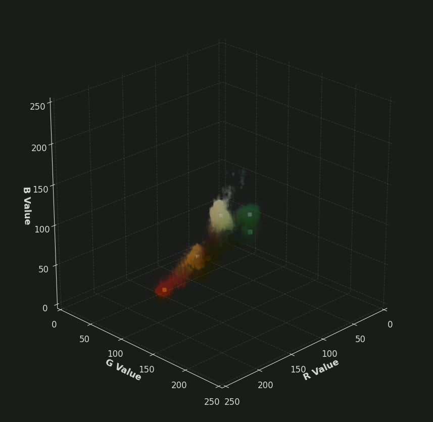

In the 3D scatterplot above all of the points have been faded until they
are nearly invisible so that we can see the cluster centers better. This
was necessary because what we had was a dense point cloud with 985,200
individual points. The white squares roughly mark the location of the
cluster centers. One can say that the algorithm managed to place the
cluster centers near the vicinity where a human agent would have done if
it was given the task.

Improving K-means performance by changing the color space
~~~~~~~~~~~~~~~~~~~~~~~~~~~~~~~~~~~~~~~~~~~~~~~~~~~~~~~~~

There’s one more tweak that we have to add to our workflow before we go
off into extracting the color palette information for the whole dataset.
That tweak has to do with changing the color space in which the
clustering happens from the RGB color space to the `CIELAB color
space <https://en.wikipedia.org/wiki/CIELAB_color_space>`__. Doing this
can improve the quality or the “fidelity” of the palettes that we are
extracting. By quality here, we mean having a color palette that is
closer to what we’d construct by hand. Explaining the reason behind this
improvement is beyond the scope of this tutorial. However, good leads
can be found in the Wikipedia pages of the concept `perceptual
uniformity <https://en.wikipedia.org/wiki/Color_difference#Tolerance>`__.

Let’s now convert the sample poster to the CIELAB color space, run the
algorithm and then look at the results. Here’s the code from converting
the image from RGB to CIELAB:

.. code:: python

    # --- convert images to LAB colorspace ---
    sample_poster_rawdata = color.rgb2lab(sample_poster_rawdata) # use scimage transform function

And finally, let’s run the k-means clustering again (this time in CIE
LAB space) to see the result.

.. code:: python

    # run k-means clustering on sample_poster_rawdata
    kmeans = cluster.KMeans(n_clusters=6)
    kmeans = kmeans.fit(sample_poster_rawdata)
    # save cluster centroids as palette
    palette = kmeans.cluster_centers_
    # reconvert to RGB for display
    palette = color.lab2rgb(palette)
    palette = util.img_as_ubyte(palette) # needed for pil compability
    # create a displayable image from numpy arrays
    palette = [
      pil.Image.new("RGB", (125, 125), tuple(col)) for col in palette
    ]
    palette = np.hstack([np.asarray(swatch) for swatch in palette])
    palette = pil.Image.fromarray(palette)
    # print the  image and the palette
    display(sample_poster.reduce(3)) # shrinked for ease of viewing
    palette

.. image:: color_clustering_tutorial_files/color_clustering_tutorial_54_0.png

For this example here the difference in result seems to be minimal, if
there is any to begin with. The brightness of the colors in the palette
seem to be more in tune with the actual poster.

Even though we did not achieve a substantial improvement, the theory is
on our side and we can be sure that this will give better results over a
larger dataset. Now, lets tidy up all the code we’ve written so far and
apply it to the whole dataset.

Extracting the color palette information for the whole dataset
~~~~~~~~~~~~~~~~~~~~~~~~~~~~~~~~~~~~~~~~~~~~~~~~~~~~~~~~~~~~~~

The code snippets below tidies up all the code we’ve written up to this
point and applies it to the whole dataset. In summary, what we are doing
is equivalent to creating two new columns in the ``results`` dataframe.
One column will hold a list of six hexadecimal numbers in string format,
each representing a color. The other column will hold the Pillow images
of the said palettes so that they can be displayed in a notebook
environment.

We first create a new column called ``TEMP_image_rawdata``. This holds
the raw pixel and color data from each of the images that we hold. The
colors are specified in the CIELAB color space.

.. code:: python

    response["TEMP_image_rawdata"] = (
        response["image"]
        .apply(lambda x: np.asarray(x, dtype="uint8").reshape(-1, 3)) # turn image into a numpy array
        .apply(lambda x: color.rgb2lab(x)) # transform rgb array into a cielab array
    )

We then create another column called ``palette_rawdata`` to hold the
cluster centers that we get after running k-means clustering on each
element of the ``TEMP_image_rawdata`` column. A word of warning for
those who want to run this notebook locally: mixing big images, K-means
clustering and dataframes is not the most computationally efficient way
of batch computing the color palette information of over a hundred
images. Computing all the color palettes with orthodox K-means takes a
long time. The below code snippet uses `Mini Batch
K-Means <https://scikit-learn.org/stable/modules/generated/sklearn.cluster.MiniBatchKMeans.html>`__
instead of orthodox K-means. This is a K-means algorithm that runs
exponentially faster than orthodox K-means at a small cost of accuracy.
Even then the whole process takes around five minutes to complete, so be
vary.

.. code:: python

    # initialize a mini batch k-means object with 6 clusters
    kmeans_instance = cluster.MiniBatchKMeans(
      n_clusters=6,
      init="k-means++",
      batch_size=1024
    )
    
    # run k-means on TEMP_image_rawdata
    # kmeans_instance.fix(x) actually returns a whole object that contains the
    # clustering info for all points. We only get the cluster centers by
    # accessing the .cluster_centers_ property of the returned object.
    response["palette_rawdata"] = (
        response["TEMP_image_rawdata"]
        .apply(lambda x: kmeans_instance.fit(x).cluster_centers_)
    )

Since the raw color data of each individual color as recorded in
``TEMP_image_rawdata`` is in the CIELAB color space, so are the six
cluster centers that we get as the result of K-means clustering. To make
that information more accessible, let’s transform them back to the RGB
space. From there, we can do two things to make our results
interpretable:

-  Create Pillow images so that we can display the color palettes in
   console.
-  Rewrite the RGB palettes as hexcode.

The code snippet below does exactly that:

.. code:: python

    # transform color representations from CIE LAB to RGB
    response["palette_rawdata"] = (
      response["palette_rawdata"]
      .apply(lambda x: color.lab2rgb(x)) # transform the color representations into rgb space
      .apply(lambda x: util.img_as_ubyte(x)) # transform color representations from floats to 8-bit unsigned integers
    )

.. code:: python

    # create a Pillow image for each palette
    response["palette_image"] = (
      response["palette_rawdata"]
      .apply(lambda x: [pil.Image.new("RGB", (125, 125), tuple(col)) for col in x])
      .apply(lambda x: np.hstack([np.asarray(swatch) for swatch in x]))
      .apply(lambda x: pil.Image.fromarray(x))
    )
    
    # rewrite the RGB palettes as hexcode
    response["palette_rawdata"] = (
        response["palette_rawdata"]
        .apply(lambda x: [rgb_to_hex(*list(swatch)) for swatch in x])
    )

Let’s tidy up the ``response`` DataFrame a little bit and then finally
look at the results.

.. code:: python

    from random import randint
    
    response = (
      response.loc[:, ["europeana_id", "title", "creator", "image", "palette_image", "palette_rawdata"]]
    )
    
    # select 5 images at random, show images and palettes
    for i in range(0, 5):
      idx = randint(0, len(response))
      display(response.loc[idx, "image"].reduce(3))
      print(response.loc[idx, "palette_rawdata"])
      display(response.loc[idx, "palette_image"])

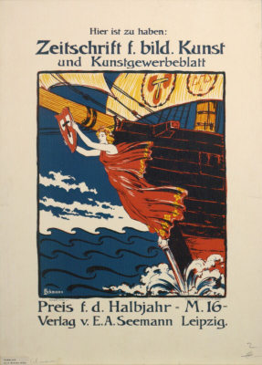

.. parsed-literal::

    ['#eadbc1', '#322c2b', '#a54629', '#2a455b', '#deac4f', '#cdc3ab']
    

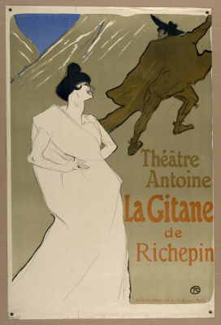

.. parsed-literal::

    ['#5e481d', '#a49471', '#d6c7ac', '#897b58', '#485d87', '#1d1b16']
    

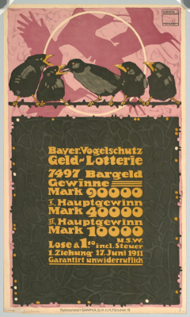

.. parsed-literal::

    ['#6b5835', '#dda396', '#d39e44', '#454434', '#b4686a', '#e2d1b8']
    

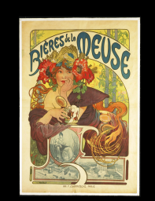

.. parsed-literal::

    ['#505e54', '#dec06e', '#020201', '#854d31', '#ece1b8', '#988556']
    

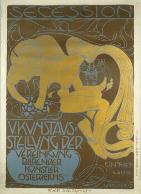

.. parsed-literal::

    ['#656252', '#ba9942', '#dfdabf', '#624f2e', '#728283', '#9d8e61']
    

Conclusion
----------

With this, we finally answered the question that we had set out the
answer. Through the use of PyEuropeana and several packages in the
Python ecosystem, we were able to create a dataset of Art Nouveau
posters and extract representative color information (color palettes)
for each of them.

As we’ve previously mentioned, the concept of extracting the color
palette of an image has a practical usecase in computer science. These
palettes can then be used (along with a series of methods known as
`dithering <https://en.wikipedia.org/wiki/Dither>`__) to create visually
similar versions of the original images that take up less space in
computer memory. The color palette information that we extracted can
also be used for other purposes such as:

-  Multimedia search: if you know what colors dominate an image, you can
   search images by color.
-  Artistic reuse: perhaps these color palettes can be used to create
   new images (by hand or algorithmically) that share the same color
   palette.
-  Scholarly study: the color palette information can be used to further
   classify and segment the posters. Alternatively, they can also be
   studied on their own.
